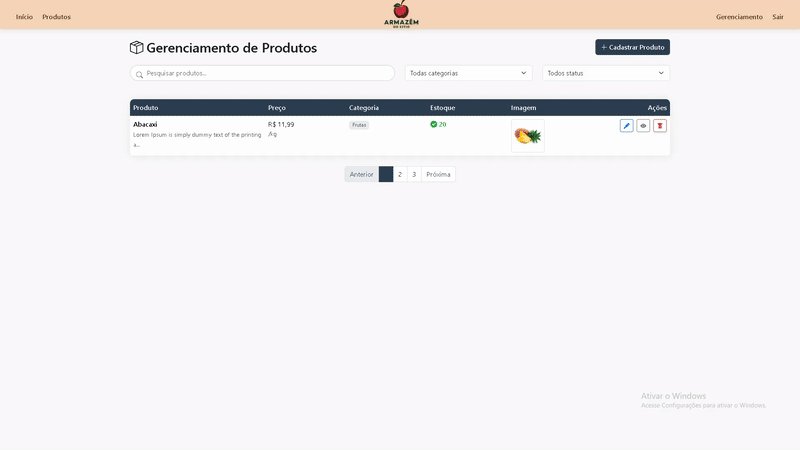

# 🌿 Plataforma Digital — Armazém do Sítio

Este projeto foi desenvolvido para o Hackathon do projeto [**Talento Tech**](https://ead.uepg.br/site/talento_tech), com o objetivo de criar uma solução digital para pequenos empreendedores locais.  
O desafio proposto busca apoiar a transformação digital de negócios familiares na região de Loanda/PR.

---

## 🧭 Desafio Proposto

- **Empresa:** Armazém do Sítio — Loanda/PR  
- **Personagem:** Sra. Lourdes, 58 anos, proprietária de um armazém com produtos artesanais e hortifrúti.  
- **Desafio:** Criar uma plataforma digital para o pequeno negócio de Lourdes, com:
  - 📦 Catálogo de produtos  
  - 💳 Pagamentos online / canal de pedido  

### 📌 Contexto Local
- População: **18 mil habitantes**  
- **70%** dos negócios são familiares  
- Acesso à internet em **68% dos domicílios**  
- A população local ainda prefere canais simples como **WhatsApp**, exigindo uma solução prática e acessível.

---

## 💻 Funcionalidades Principais

- 🛍️ **Catálogo de Produtos:** exibe produtos artesanais e hortifrúti com foto, preço, categoria e estoque disponível.  
- 🛒 **Carrinho de Compras Dinâmico:** o cliente pode adicionar produtos ao carrinho, visualizar o resumo dos itens e seguir para o checkout.  
- 💳 **Checkout de Pedido:** formulário de compra com nome, forma de pagamento e observações, validando itens no carrinho e estoque disponível.  
- 📲 **Integração com WhatsApp:** o pedido é enviado para o WhatsApp com detalhes completos dos produtos, valores, quantidade, forma de pagamento e observações.  
- 🧾 **Registro de Vendas:** cada pedido é salvo no banco de dados como venda pendente, com itens, total, status e informações do cliente.  
- 📊 **Gestão de Vendas:** painel administrativo para visualizar vendas, listar pedidos e alterar status para **confirmado** ou **cancelado**.  
- 🔐 **Área Administrativa Protegida:** login de administrador, registro de novos administradores e sessão segura para acessar o painel.  
- 🧰 **CRUD de Produtos:** cadastrar, editar e excluir produtos diretamente pelo painel administrativo.  
- 📦 **Atualização de Estoque:** o sistema controla estoque automaticamente durante a compra e no checkout.

---

## 🔐 Área Administrativa

💡 Veja abaixo um GIF do painel administrativo demo:

## 🛠️ Tecnologias Utilizadas

| Tecnologia      | Descrição                                 |
|-----------------|-------------------------------------------|
| [Node.js](https://nodejs.org)        | Ambiente de execução JavaScript no servidor |
| [Express](https://expressjs.com)     | Framework backend para Node.js |
| [EJS](https://ejs.co)                | Template engine para renderização de páginas dinâmicas |
| [MySQL](https://www.mysql.com)       | Banco de dados relacional para armazenar produtos, pedidos e clientes |
| [WhatsApp API](https://wa.me)        | Canal de comunicação direta com a proprietária |
